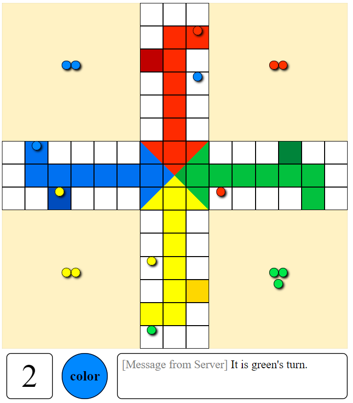

My first project with React and JavaScript. Looking back, even though the game works fine, the code is unoptimized, has some hard-coded tricks, and even breaks some unspoken rules (some objects are not immutable).

To host the game, input `node server.js` into a terminal.

To connect to the game, input this url into your browser: `http://localhost:8000/ludo`.

The game will start only after the arrival of a 4th player. Player turn order is fixed.

This was originally an assignment. All the requirements of the assignment have been met and some non-required error handling has been done; sprite route end handled, messing around with other player pieces, etc. For obvious reasons, the assignment prompt is not provided.

Players are not disconnected and the game is not forcefully ended upon the determination of a winner (as it was not required). Thus, players can still mess around post-game-end if they wish.
